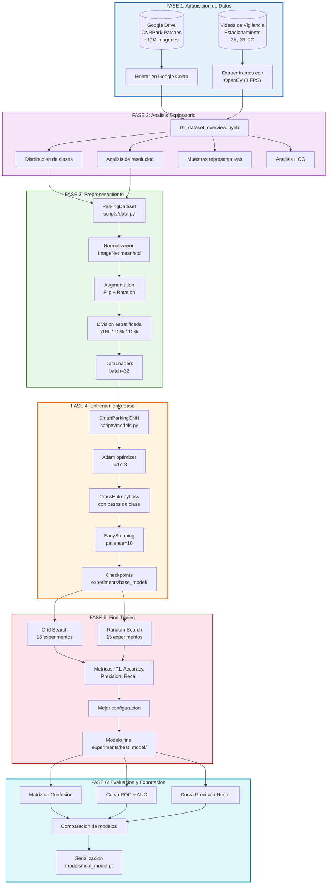
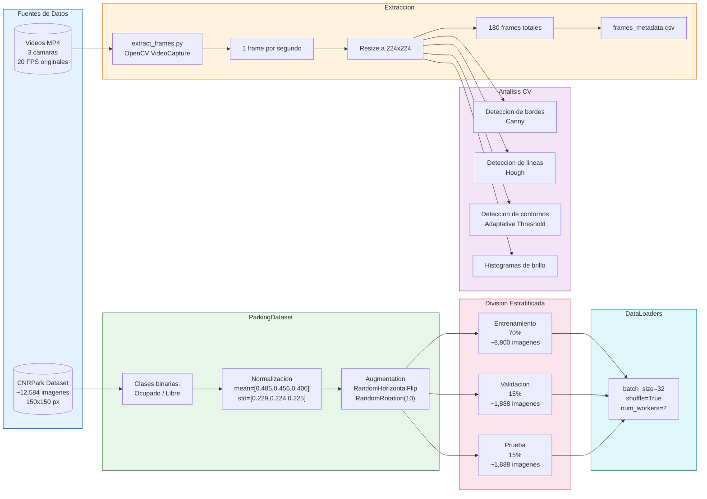
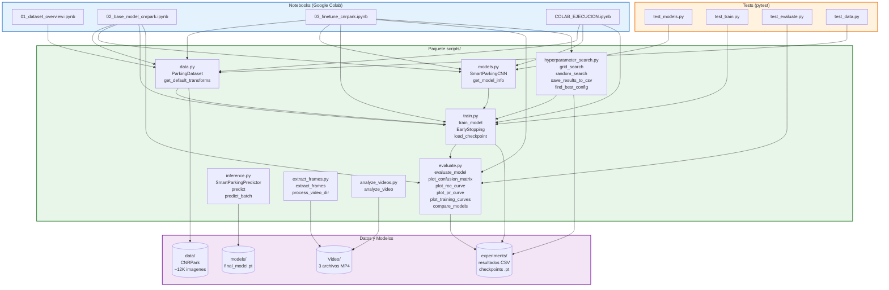
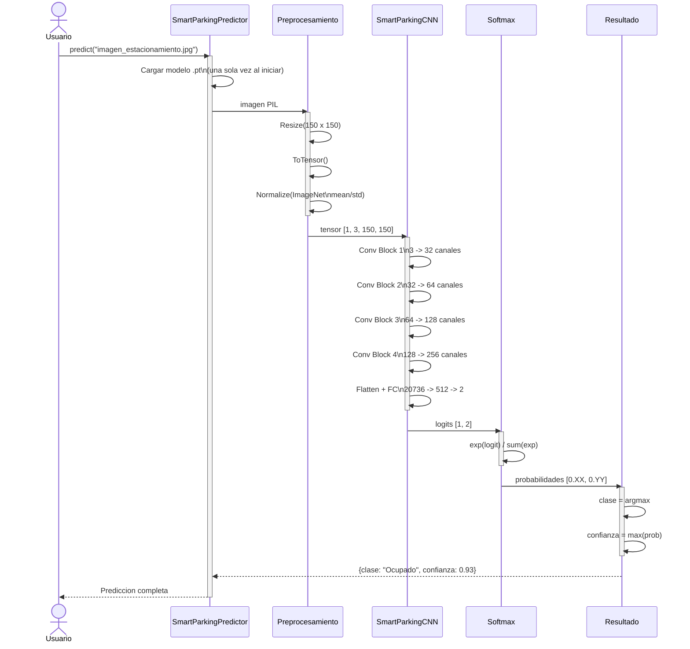
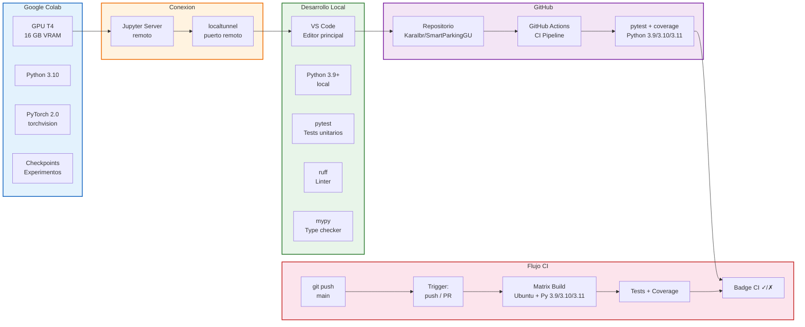

# Diagramas del Proyecto SmartParkingGU

Diagramas Mermaid que explican la arquitectura, flujo de datos y operacion del sistema de deteccion de ocupacion de estacionamiento.

---

## 1. Flujo General del Proyecto

---

## 2. Pipeline de Datos

---

## 3. Arquitectura SmartParkingCNN

```mermaid
flowchart TD
    INPUT["Entrada\n[B, 3, 150, 150]\nRGB normalizado"]

    subgraph BLOQUE1["Bloque Conv 1"]
        C1A["Conv2d(3, 32, kernel=3, padding=1)"]
        C1B["BatchNorm2d(32)"]
        C1C["ReLU"]
        C1D["MaxPool2d(2)"]
        C1S["Salida: [B, 32, 75, 75]"]
    end

    subgraph BLOQUE2["Bloque Conv 2"]
        C2A["Conv2d(32, 64, kernel=3, padding=1)"]
        C2B["BatchNorm2d(64)"]
        C2C["ReLU"]
        C2D["MaxPool2d(2)"]
        C2S["Salida: [B, 64, 37, 37]"]
    end

    subgraph BLOQUE3["Bloque Conv 3"]
        C3A["Conv2d(64, 128, kernel=3, padding=1)"]
        C3B["BatchNorm2d(128)"]
        C3C["ReLU"]
        C3D["MaxPool2d(2)"]
        C3S["Salida: [B, 128, 18, 18]"]
    end

    subgraph BLOQUE4["Bloque Conv 4"]
        C4A["Conv2d(128, 256, kernel=3, padding=1)"]
        C4B["BatchNorm2d(256)"]
        C4C["ReLU"]
        C4D["MaxPool2d(2)"]
        C4S["Salida: [B, 256, 9, 9]"]
    end

    FLATTEN["Flatten\n256 x 9 x 9 = 20,736"]

    subgraph FC["Capas Fully Connected"]
        FC1["Linear(20736, 512)"]
        FC1R["ReLU"]
        FC1D["Dropout(0.5)"]
        FC2["Linear(512, 2)"]
    end

    SOFTMAX["Softmax"]

    subgraph SALIDA["Salida"]
        S1["Clase 0: Ocupado"]
        S2["Clase 1: Libre"]
    end

    INPUT --> C1A
    C1A --> C1B --> C1C --> C1D --> C1S
    C1S --> C2A
    C2A --> C2B --> C2C --> C2D --> C2S
    C2S --> C3A
    C3A --> C3B --> C3C --> C3D --> C3S
    C3S --> C4A
    C4A --> C4B --> C4C --> C4D --> C4S
    C4S --> FLATTEN
    FLATTEN --> FC1
    FC1 --> FC1R --> FC1D --> FC2
    FC2 --> SOFTMAX
    SOFTMAX --> S1
    SOFTMAX --> S2

    style INPUT fill:#e3f2fd,stroke:#1565c0,stroke-width:2px
    style BLOQUE1 fill:#e8f5e9,stroke:#2e7d32
    style BLOQUE2 fill:#f1f8e9,stroke:#558b2f
    style BLOQUE3 fill:#fff8e1,stroke:#f9a825
    style BLOQUE4 fill:#fff3e0,stroke:#ef6c00
    style FLATTEN fill:#fce4ec,stroke:#c62828,stroke-width:2px
    style FC fill:#f3e5f5,stroke:#7b1fa2
    style SOFTMAX fill:#e0f7fa,stroke:#00838f,stroke-width:2px
    style SALIDA fill:#e0f7fa,stroke:#00838f
```

---

## 4. Modulos del Codigo (Relaciones)

---

## 5. Flujo de Inferencia (Prediccion)

---

## 6. Entorno de Ejecucion

